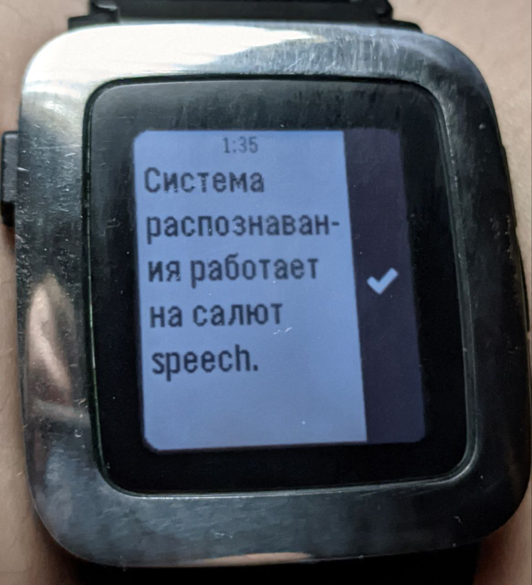

# Salute, Pebble!

Replacement dictation service for Pebble Time/Pebble 2 based on SaluteSpeech, voice service developed and maintained by Russian Sberbank.

Please note that this service is relevant only for russian-speaking Pebble community, especially living in Russia or CIS.

## Demo




## How to install

This software relies on [Speex Python Library](https://pypi.org/project/speex/) which is unfortunately outdated and works only with <= Python 3.7. Keep in mind that this is Linux-only app.

Before proceeding, if it's not already, you need to install Python 3.7 as an alternative of the version currently installed on your system. I won't cover this part, there are already plenty of tutorials on internet on how to do this.

Steps to install the app:
* Clone the project and enter the folder:
```shell
git clone https://github.com/veselcraft/salutepebble.git
cd salutepebble
```
* Create a virtual environment: 
```shell
python3.7 -m venv venv
```
* Activate the virtual environment:
```shell
source venv/bin/activate
```
* Install the Debian/Ubuntu requirements to compile speex:

```shell
sudo apt-get install build-essential libspeex-dev libspeexdsp-dev libpulse-dev
```

* Install the required Python modules:
```shell
pip install -r requirements.txt
```

**Note:** Gunicorn may fail to install because of a bug. A patch exists and has been merged on the Gunicorn repository
but it's still not released.

Workaround:
```shell
pip uninstall gunicorn
pip install https://github.com/benoitc/gunicorn/archive/refs/heads/master.zip --no-cache-dir
```

### Configure SaluteSpeech

To be honest, I haven't inquired about the availability of SaluteSpeech in countries other than Russia, but for individuals there is a free tariff with 100 minutes of speech recognition. If you suddenly need more, there's a 1000 minutes package for a year can be purchased for 1200 ₽.

1. Go to [SaluteSpeech's website](https://developers.sber.ru/portal/products/smartspeech)
2. Click on "Cost" at the top, and then on "Try", while remembering to select "For Individuals"
3. Register or log in via SberID
4. After a few pop-ups, the studio should open. Open projects, create a project "SaluteSpeech". Call it whatever you want
5. When creating it, you will be prompted to save the secret data to create the token. Save them
6. Write that secret data into the "config.py-example" file and remove the "-example" from the filename

### Running and use it with Pebble app

* Start the application:
```shell
python app.py
```

To use this app from your Pebble you need to use a Reverse Proxy (I.E: Nginx for permanent solution or Ngrok if you wanna test it) in front of the app to upgrade the connection from HTTP to HTTPS, a self-signed certificate should be enough. HTTP doesn't work at all, official Pebble app is hardcoded to use HTTPS connection.

By default the app runs on 9001 port.

Steps on Rebble Website:

* Login on https://rebble.io
* Click on "My Account"
* Click on the button on the bottom "I know what I'm doing, show me the options anyway!"
* Change the configuration in:

```json
{
    "config": {
        "voice": {
            "languages": [
                {
                    "endpoint": "YOUR_HOSTNAME_HERE",
                    "six_char_locale": "rus-RUS",
                    "four_char_locale": "ru_RU"
                }
            ],
            "first_party_uuids": [
                ""
            ]
        }
    }
}
```

`six_char_locale` and `four_char_locale` should be changed accordingly to the corresponding of your language. For `six_char_locale` you should use the "-" symbol, for `four_char_locale` you should use the "_" symbol.

* Click on "Ok, well, I guess that looks good."
* Open "https://boot.rebble.io" on your phone and do the configuration again

If everything has been done correctly, in the Pebble App settings, Dictation section, you should see Russian language. **Be sure to select a language to override the default settings**.

## Start as a service

The following steps has been tested only on Raspberry Pi and MAY work on Debian/Ubuntu.

* Create a new service with your favourite editor (I use Nano, at least I know how to close it):
```shell
sudo nano /etc/systemd/system/salutepebble.conf
```
* Copy the following configuration, changing the PATH_TO_SALUTEPEBBLE to the corresponding on your system:
```shell
[Unit]
Description=Pebble SaluteSpeech Based Dictation service
After=network.target

[Service]
User=pi
Group=www-data
WorkingDirectory=/PATH_TO_SALUTEPEBBLE/salutepebble/
Environment="PATH=/PATH_TO_SALUTEPEBBLE/salutepebble/venv/bin"
ExecStart=/PATH_TO_SALUTEPEBBLE/salutepebble/venv/bin/gunicorn --access-logfile - --workers 1 --bind 127.0.0.1:9001 --worker-class eventlet app:app

[Install]
WantedBy=multi-user.target
```
* Enable the service automatic restart/start at boot:
```shell
sudo systemctl enable salutepebble.service
```
* Start the service
```shell
sudo systemctl start salutepebble.service
```

## Resources:
* SaluteSpeech landing: https://developers.sber.ru/portal/products/smartspeech
* SaluteSpeech documentation: https://developers.sber.ru/docs/ru/salutespeech/category-overview
* Rebble ASR: https://github.com/pebble-dev/rebble-asr
* Reddit discussion for Rebble Service configuration: https://www.reddit.com/r/pebble/comments/llqdv6/self_hosted_dictation_service/
